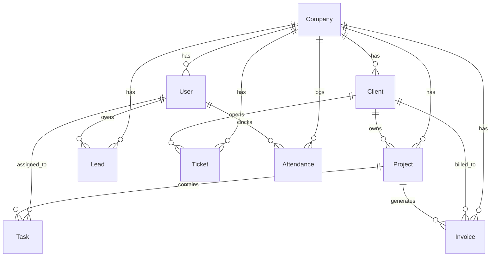

# 🗄️ Database Schema & Models Guide

This document outlines the complete relational database design for **SAAMPARK CRM**.

---

## 📐 Entity Relationship Summary



---

## 📋 Table Definitions

### 1. `companies`
Represents the business entities (e.g. SAAMPARK Technology, SAAMPARK Digital Marketing).
| Column | Type | Constraints | Description |
|---|---|---|---|
| `id` | VARCHAR(36) / UUID | PRIMARY KEY | Unique ID (e.g. `comp_tech_01`) |
| `name` | VARCHAR(150) | NOT NULL | Company Name |
| `slug` | VARCHAR(100) | UNIQUE, NOT NULL | URL-safe slug |
| `currency` | VARCHAR(10) | DEFAULT 'INR' | Base currency (`INR`, `USD`) |
| `currency_symbol`| VARCHAR(5) | DEFAULT '₹' | Currency symbol |
| `logo_url` | TEXT | NULLABLE | Logo URL |
| `created_at` | TIMESTAMP | DEFAULT NOW() | |
| `updated_at` | TIMESTAMP | DEFAULT NOW() | |

---

### 2. `users`
System users across all roles.
| Column | Type | Constraints | Description |
|---|---|---|---|
| `id` | VARCHAR(36) / UUID | PRIMARY KEY | Unique User ID |
| `company_id` | VARCHAR(36) | FOREIGN KEY (`companies.id`), NULLABLE | NULL if Super Admin |
| `email` | VARCHAR(255) | UNIQUE, NOT NULL | Login Email |
| `password_hash`| VARCHAR(255) | NOT NULL | Bcrypt / Argon2 hash |
| `first_name` | VARCHAR(100) | NOT NULL | |
| `last_name` | VARCHAR(100) | NOT NULL | |
| `avatar_url` | TEXT | NULLABLE | Profile photo |
| `role` | ENUM | NOT NULL | `SUPER_ADMIN`, `ADMIN`, `MANAGER`, `EMPLOYEE`, `CLIENT` |
| `is_active` | BOOLEAN | DEFAULT TRUE | Account status |
| `created_at` | TIMESTAMP | DEFAULT NOW() | |

---

### 3. `clients`
Clients / Customers who purchase services or projects.
| Column | Type | Constraints | Description |
|---|---|---|---|
| `id` | VARCHAR(36) / UUID | PRIMARY KEY | Unique Client ID |
| `company_id` | VARCHAR(36) | FOREIGN KEY, NOT NULL | Tenant isolation |
| `name` | VARCHAR(200) | NOT NULL | Company / Client Name |
| `email` | VARCHAR(255) | NOT NULL | Primary contact email |
| `phone` | VARCHAR(50) | NULLABLE | Phone number |
| `status` | ENUM | DEFAULT 'Active' | `Active`, `Inactive`, `Lead` |
| `address` | TEXT | NULLABLE | Billing address |
| `total_revenue`| DECIMAL(12, 2)| DEFAULT 0.00 | Computed or cached revenue |
| `created_at` | TIMESTAMP | DEFAULT NOW() | |

---

### 4. `leads`
Sales pipeline leads before they convert into clients.
| Column | Type | Constraints | Description |
|---|---|---|---|
| `id` | VARCHAR(36) / UUID | PRIMARY KEY | Unique Lead ID |
| `company_id` | VARCHAR(36) | FOREIGN KEY, NOT NULL | Tenant isolation |
| `name` | VARCHAR(200) | NOT NULL | Company or Lead title |
| `primary_contact` | VARCHAR(150) | NOT NULL | Contact person name |
| `phone` | VARCHAR(50) | NULLABLE | Phone |
| `owner_id` | VARCHAR(36) | FOREIGN KEY (`users.id`) | Assigned sales rep |
| `value` | DECIMAL(12, 2)| DEFAULT 0.00 | Estimated deal value |
| `status` | ENUM | DEFAULT 'New' | `New`, `Discussion`, `Negotiation`, `Qualified`, `Won`, `Lost` |
| `created_at` | TIMESTAMP | DEFAULT NOW() | |

---

### 5. `projects`
Projects delivered to clients.
| Column | Type | Constraints | Description |
|---|---|---|---|
| `id` | VARCHAR(36) / UUID | PRIMARY KEY | Unique Project ID |
| `company_id` | VARCHAR(36) | FOREIGN KEY, NOT NULL | Tenant isolation |
| `client_id` | VARCHAR(36) | FOREIGN KEY (`clients.id`) | Client reference |
| `title` | VARCHAR(255) | NOT NULL | Project Name |
| `status` | ENUM | DEFAULT 'Open' | `Open`, `Completed`, `Hold`, `Cancelled` |
| `progress_percent`| INT | DEFAULT 0 | 0 to 100% |
| `start_date` | DATE | NULLABLE | |
| `deadline` | DATE | NULLABLE | |
| `price` | DECIMAL(12, 2)| DEFAULT 0.00 | Total project price |
| `created_at` | TIMESTAMP | DEFAULT NOW() | |

---

### 6. `tasks`
Individual tasks under projects or stand-alone.
| Column | Type | Constraints | Description |
|---|---|---|---|
| `id` | VARCHAR(36) / UUID | PRIMARY KEY | Unique Task ID |
| `company_id` | VARCHAR(36) | FOREIGN KEY, NOT NULL | Tenant isolation |
| `project_id` | VARCHAR(36) | FOREIGN KEY (`projects.id`), NULLABLE | |
| `assigned_to` | VARCHAR(36) | FOREIGN KEY (`users.id`), NULLABLE | |
| `title` | VARCHAR(255) | NOT NULL | Task title |
| `status` | ENUM | DEFAULT 'To_do' | `To_do`, `In_progress`, `Review`, `Done`, `Expired` |
| `priority` | ENUM | DEFAULT 'Medium' | `Low`, `Medium`, `High`, `Urgent` |
| `start_date` | DATE | NULLABLE | |
| `deadline` | DATE | NULLABLE | |
| `created_at` | TIMESTAMP | DEFAULT NOW() | |

---

### 7. `invoices`
Invoices generated for clients.
| Column | Type | Constraints | Description |
|---|---|---|---|
| `id` | VARCHAR(36) / UUID | PRIMARY KEY | Unique Invoice ID |
| `company_id` | VARCHAR(36) | FOREIGN KEY, NOT NULL | Tenant isolation |
| `client_id` | VARCHAR(36) | FOREIGN KEY (`clients.id`) | Client reference |
| `invoice_number`| VARCHAR(50) | UNIQUE, NOT NULL | e.g. `INV-2026-001` |
| `total_amount` | DECIMAL(12, 2)| NOT NULL | Total invoice value |
| `paid_amount` | DECIMAL(12, 2)| DEFAULT 0.00 | Amount paid |
| `status` | ENUM | DEFAULT 'Draft' | `Draft`, `Not_paid`, `Partially_paid`, `Fully_paid`, `Overdue` |
| `due_date` | DATE | NOT NULL | Due date |
| `created_at` | TIMESTAMP | DEFAULT NOW() | |

---

### 8. `attendance`
Clock In / Clock Out attendance and timesheet records.
| Column | Type | Constraints | Description |
|---|---|---|---|
| `id` | VARCHAR(36) / UUID | PRIMARY KEY | Unique ID |
| `company_id` | VARCHAR(36) | FOREIGN KEY, NOT NULL | Tenant isolation |
| `user_id` | VARCHAR(36) | FOREIGN KEY (`users.id`) | Employee reference |
| `clock_in` | TIMESTAMP | NOT NULL | When the user clocked in |
| `clock_out` | TIMESTAMP | NULLABLE | When the user clocked out |
| `total_seconds`| INT | DEFAULT 0 | Computed duration in seconds |
| `note` | TEXT | NULLABLE | Optional note on work done |
| `created_at` | TIMESTAMP | DEFAULT NOW() | |

---

### 9. `tickets`
Support tickets submitted by clients or team members.
| Column | Type | Constraints | Description |
|---|---|---|---|
| `id` | VARCHAR(36) / UUID | PRIMARY KEY | Unique Ticket ID |
| `company_id` | VARCHAR(36) | FOREIGN KEY, NOT NULL | Tenant isolation |
| `client_id` | VARCHAR(36) | FOREIGN KEY (`clients.id`), NULLABLE | |
| `subject` | VARCHAR(255) | NOT NULL | Ticket Subject |
| `department` | ENUM | DEFAULT 'General' | `General_Support`, `Bug_Reports`, `Sales_Inquiry` |
| `status` | ENUM | DEFAULT 'New' | `New`, `Open`, `Closed` |
| `created_at` | TIMESTAMP | DEFAULT NOW() | |

---

## ⚡ Ready-to-use Prisma Schema Snippet

```prisma
datasource db {
  provider = "postgresql"
  url      = env("DATABASE_URL")
}

generator client {
  provider = "prisma-client-js"
}

enum Role {
  SUPER_ADMIN
  ADMIN
  MANAGER
  EMPLOYEE
  CLIENT
}

enum TaskStatus {
  To_do
  In_progress
  Review
  Done
  Expired
}

model Company {
  id          String       @id @default(uuid())
  name        String
  slug        String       @unique
  currency    String       @default("INR")
  users       User[]
  clients     Client[]
  projects    Project[]
  leads       Lead[]
  invoices    Invoice[]
  attendance  Attendance[]
  tickets     Ticket[]
  createdAt   DateTime     @default(now())
  updatedAt   DateTime     @updatedAt
}

model User {
  id           String       @id @default(uuid())
  companyId    String?
  company      Company?     @relation(fields: [companyId], references: [id])
  email        String       @unique
  password     String
  firstName    String
  lastName     String
  role         Role
  tasks        Task[]
  leads        Lead[]
  attendance   Attendance[]
  createdAt    DateTime     @default(now())
}

model Client {
  id          String     @id @default(uuid())
  companyId   String
  company     Company    @relation(fields: [companyId], references: [id])
  name        String
  email       String
  phone       String?
  status      String     @default("Active")
  projects    Project[]
  invoices    Invoice[]
  tickets     Ticket[]
  createdAt   DateTime   @default(now())
}
```
